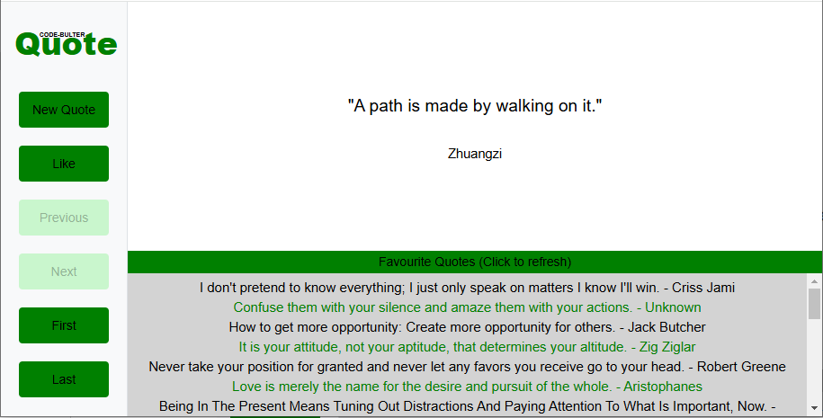

# Quote web app written in ReactJS
This web app can be used with the java API backend which can be found at:
> https://github.com/edwinbulter/quote-server

Or with the python/django API backend which can be found at:
> https://github.com/edwinbulter/quote-django

## Screenshot

Implemented features:
- Favourite Quotes Feed
  - When a user likes a quote, the quote is send to all other users (only works for the quote-server java backend)
  - Liked quotes are added in the top of the Favourite Quotes box
- Favourite Quotes Loading
  - When the screen starts, the liked quotes are fetched and loaded in the Favourite Quotes box
  - The header of the favourite quotes box also functions as a refresh button, which comes in handy if the backend doesn't implement the feed functionality like quote-django backend
- New Quote Button:
  - Requests a new Random quote and sends the ids of all previously received quotes in the request to avoid receiving the same quote again
  - The button is disabled while the new quote is loading (and displays loading...)
- Like Button:
  - Sends a request to like the current quote
  - The button is disabled and displays liking... while the request is being sent
  - The button is disabled and displays Like when the user has already liked the quote
- Walking through the quote history:
  - All quotes received can be watched again, or liked unless the user has already liked it
  - The history can be browsed with the next buttons:
    - Previous Button:
      - Shows the previous quote, when there is one
      - Is disabled if there is no previous quote
    - Next Button
      - Shows the next quote, when there is one
      - Is disabled if ther is no next quote
    - First 
      - jumps to the first received quote
    - Last
      - jumps to the last received quote

